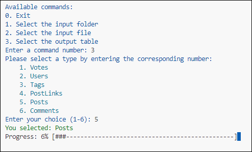

# StackOverflow.com Dump to DB
A project for importing dump from StackOverflow into a database.
Right now supports SQLITE and POSTGRES. 

## Download file
1. First download all `*.stackoverflow.com.7z` frile from [https://archive.org/download/stackexchange/](https://archive.org/download/stackexchange/).
2. Extract `7z` files and put the extracted `xml` files inside the [./inputs](./inputs/) folder.
3. It supports the following data at the moment:

    - [stackoverflow.com-Badges.7z](https://archive.org/download/stackexchange/stackoverflow.com-Badges.7z) 
    - [stackoverflow.com-Comments.7z](https://archive.org/download/stackexchange/stackoverflow.com-Comments.7z)
    - [stackoverflow.com-PostHistory.7z](https://archive.org/download/stackexchange/stackoverflow.com-PostHistory.7z)
    - [stackoverflow.com-PostLinks.7z](https://archive.org/download/stackexchange/stackoverflow.com-PostLinks.7z)
    - [stackoverflow.com-Posts.7z](https://archive.org/download/stackexchange/stackoverflow.com-Posts.7z)
    - [stackoverflow.com-Tags.7z](https://archive.org/download/stackexchange/stackoverflow.com-Tags.7z)
    - [stackoverflow.com-Users.7z](https://archive.org/download/stackexchange/stackoverflow.com-Users.7z)
    - [stackoverflow.com-Votes.7z](https://archive.org/download/stackexchange/stackoverflow.com-Votes.7z)

## Creating the Virtual Environment
First, navigate to your project's root directory in your terminal. Then, create a virtual environment named venv (or another name of your choice) by running:

```
python -m venv venv
```

This command creates a new directory named venv in your project directory, which contains a copy of the Python interpreter, the standard library, and various supporting files.

## Activating the Virtual Environment
Before you can start installing packages, you need to activate the virtual environment. 
Activation will ensure that the Python interpreter and tools within the virtual environment are used in preference to the system-wide Python installation.

1. **On macOS and Linux:**

```
source venv/bin/activate
```

2. **On Windows (cmd.exe):**

```
.\venv\Scripts\activate.bat
```

3. **On Windows (PowerShell) or VSC Terminal:**

```
.\venv\Scripts\Activate.ps1
```

Once activated, your terminal prompt must change to indicate that the virtual environment is active.

## Installing Dependencies

With the virtual environment activated, install the dependencies listed in `requirements.txt` by running:

```
pip install -r requirements.txt
```

Or you can install them directly. Ensure you have the following installed in your Python environment. If not, you can install them using pip:

```
pip install python-dotenv
pip install colored
pip install psycopg2-binary
pip install markdownify
pip install beautifulsoup4 html2text
```

## Configuration
Copy and paste the `.env.example` file and rename the new file to `.env`. 
Edit the `.env` file as following:
1. Make a StackExchange application and copy and paste the application key as `APP_KEY`
2. Make sure that you sellect the right DBMS type. If you want Sqlite the keep `SQLITE` otherwise if you want Postgres keep `POSTGRES`
3. `DB_PATH` is needed for Sqlite and other `DB_*` attributes are needed for Postgres databases. 

## Run
Run the `main.py` file to run the program. 
```
python main.py
```

## Sample Execution

